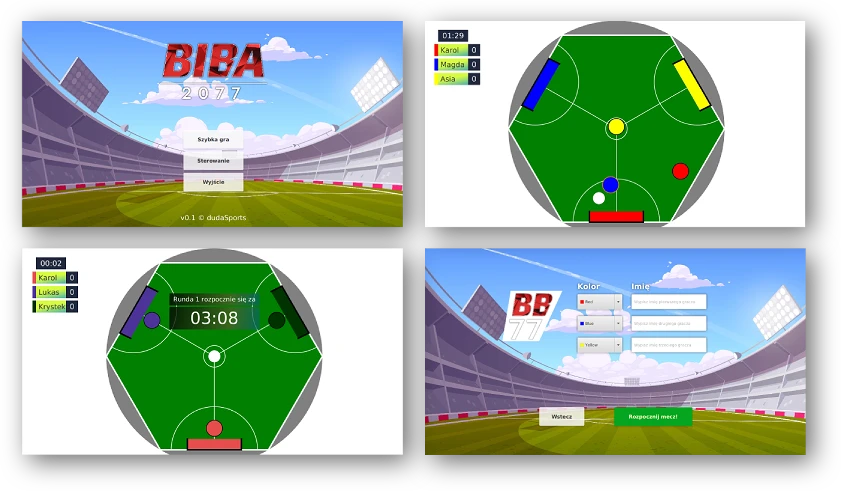

    <h1><a href="https://biba77.herokuapp.com/">Play the game now!</a></h1>
    

## Features

- Self-written collision mechanic which mimics real-life ball collisions.
- Player customization
- Reactions from most famous Polish football sportscasters
- Soundtrack system with easy track swapping
- Solved the uneven teams problem in 3-people group matchups

## How to add sound

> **Browser version** of BIBA 2077 does not support sound at this moment. For the best experience it is recommended to build the game from GitHub source files!

The game is missing additional sound effects and music. You can download it <a href="https://bayfiles.com/j87bJ0lbye/sound_rar">using this link</a>. Simply unzip the archive content to the corresponding folders in `src/main/resources/sound`.

## Special thanks

- <a href="https://www.jpro.one/">JPro.one</a> devs for making it possible to run the game in browser
- BroCode's awesome JavaFX <a href="https://www.youtube.com/watch?v=_7OM-cMYWbQ&list=PLZPZq0r_RZOM-8vJA3NQFZB7JroDcMwev">tutorials</a>
- Menu background created by <a href="https://freepik.com/pikisuperstar">pikisuperstar</a>
- <a href="https://github.com/Boomber863">Jan Gnatkowski</a> for modelling the hexagonal field
- <a href="https://github.com/wojtekczajka">Wojtek Czajka</a> for great ideas and brainstorming