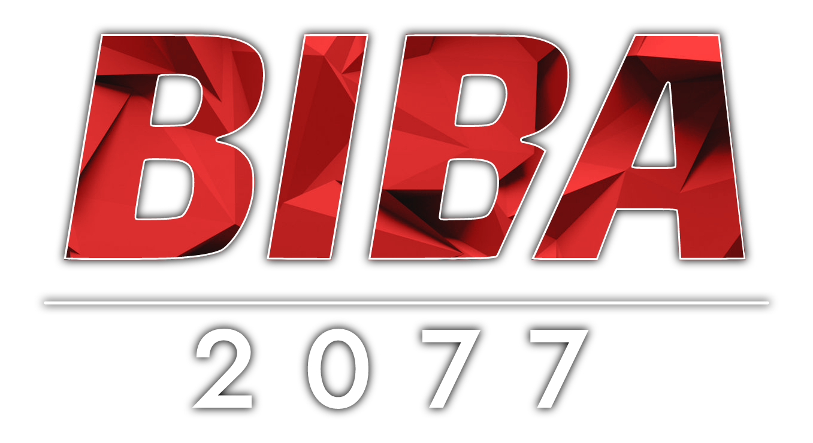

    

## Project description

A game made in JavaFX based on the concept of <a href="https://en.wikipedia.org/wiki/Three_sided_football">3 sided football</a>.

## Additional resources

The game is missing additional sound effects and music. You can download it <a href="https://bayfiles.com/j87bJ0lbye/sound_rar">using this link</a>. Simlpy unzip the files to the corresponding folders in `src/main/resources/sound`.

## Special thanks

- EA Logo <a href="https://befonts.com/ea-logo-font.html">font</a>
- Voice Generator created by <a href="https://www.masswerk.at/mespeak/">Norbert Landsteiner</a>
- Menu background created by <a href="https://freepik.com/pikisuperstar">pikisuperstar</a>